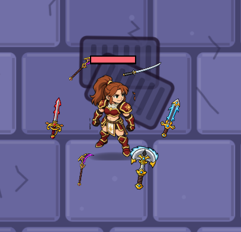

  Est-ce que tu ne trouves pas que la taille du katana et de la faux, par exemple, est plus petite que la hache et la lame unique ? Qu'en penses-tu ? Est-ce dû au design de base ou juste une question de proportions ? 

Quand j'essaie de sélectionner le niveau de danger, il y a un petit bug pour passer d'Obsidienne à Astral. Avec la manette, quand je fais flèche droite ou que je utilise le joystick, il s'arrête à Obsidienne et je dois appuyer sur la flèche du bas pour aller à Astral. 

L'animation de l'épéiste me convient parfaitement. Tu peux procéder à l'animation de tout le reste des personnages disponibles en jeu maintenant. 