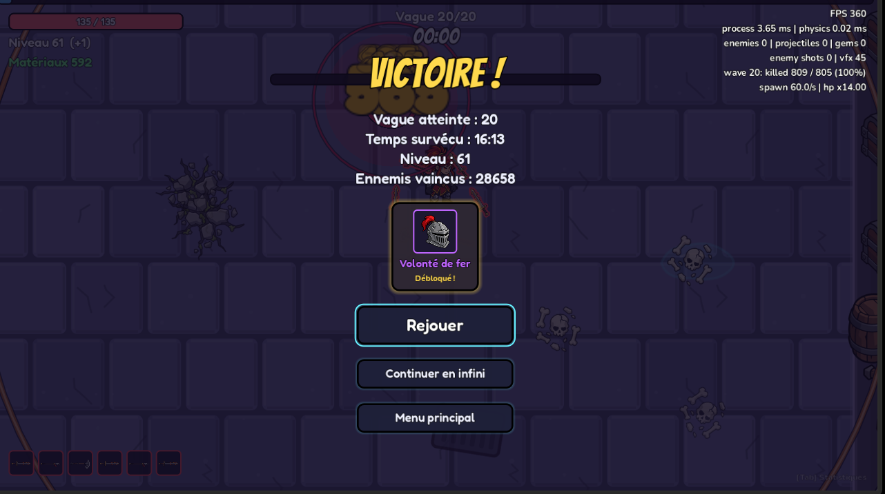

J'ai fait un playtest avec l'épéiste en danger 0, il me semble.  Et à la vague 14, j'avais déjà mes six armes en légendaires et je ne devais plus bouger pour vaincre les ennemis. Y a-t-il une explication à cela ? Est-ce que c'est parce que je suis en danger 0 ou alors la RNG des pulls dans la boutique fait en sorte que je sois déjà quasi maxé à cet endroit-là ? Ce qui veut dire que si, à partir de la manche de la vague 14 ou 15, je les roule dessus, je vais accumuler encore plus de pièces pour la boutique. Je ne te demande pas de rééquilibrer ça maintenant, mais juste de savoir si il y a un raisonnement. Est-ce qu'il y a un raisonnement s'il y a de la classe, au pool d'objets et à la boutique, ou en règle générale ? Peut-être que le nombre d'objets n'est pas assez élevé, donc je tombe trop de fois sur les bonnes cartes pour rendre mon perso trop puissant. 
J'ai arrêté mon playtest à la vague 31 en mode infini. Je n'ai pas fait d'achat dans la boutique depuis longtemps et il me reste 15000 matériaux. Mon personnage n'est pas mort mais j'en avais juste marre de continuer. 

Autour des personnages jouables, pendant une partie, il y a une sorte de contour noir qui ressemble à de la fumée. Elle n'est pas très épaisse, mais elle est quand même dérangeante visuellement parlant.  Est-ce qu'il y a une solution pour que le personnage aie un contour noir fin et lisse sans effet de débordement ?

 Ici sur l'écran de victoire, on voit que j'ai débloqué « Volonté de faire » mais quand je mets la souris dessus, il ne précise pas à quoi ça correspond. Est-ce un défi, un personnage, un skin ? 