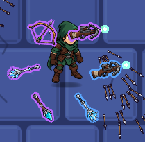

La baguette de feu envoie des boules orange mais il n'y a pas de visuel qui fait que ça ressemble vraiment à du feu. Je veux dire, le sprite est simple, mais il faudrait quand même un visuel qui fait que ça ressemble vraiment à du feu. Pareil pour les autres projectiles des autres personnages.

Je trouve également les animations d'attaque d'armes avec les armes de mêlée trop simplistes. C'est que des arcs de cercle de différentes couleurs, très difficiles à distinguer les uns des autres et pas très beaux visuellement. Il faudrait vraiment améliorer ça. Je pense que tu peux y arriver sans problème. Je n'aime pas du tout le rendu actuel.

J'aimerais également que les projectiles des ennemis soient plus travaillés, pas de boule rouge toute simple. Surtout que certains ennemis lancent des projectiles assez rapidement, donc les visuels des projectiles sont assez écrasés, donc on ne voit pas très bien ce que c'est.

Comme nous sommes maintenant sur un jeu de thème fantaisie, les bruits sonores des armes et des projectiles doivent être en accord avec l'arme. Les bruits actuels sont très génériques.

Concernant les cartes dans la sélection des personnages, le chasseur novice ne rentre pas très bien dans la carte et pareil pour l'assassin. La description n'est pas centrée et les +10 % de vitesse de déplacement dépassent même la carte.

Je veux que chaque personnage ait le choix entre deux armes de départ et pourtant l'épéiste a le choix entre trois armes.

L'affichage des dégâts : je n'aime pas trop la typologie. C'est un peu trop rond à mon goût. Peux-tu la faire un peu plus carrée et retricire un tout petit peu la dimension ? La couleur jaune, du coup, critique : j'aimerais plus une couleur jaune vive que jaune pâle.

  Le cercle d'armes autour du personnage n'est pas bien centré et cache un peu la tête du personnage. Je propose d'élargir un tout petit peu le cercle et de le remonter un tout petit peu. 

Lorsque tu fais tes tests de débogage, peux-tu éviter de le faire en plein écran, mais en fenêtre réduite comme avant s'il te plaît ? 